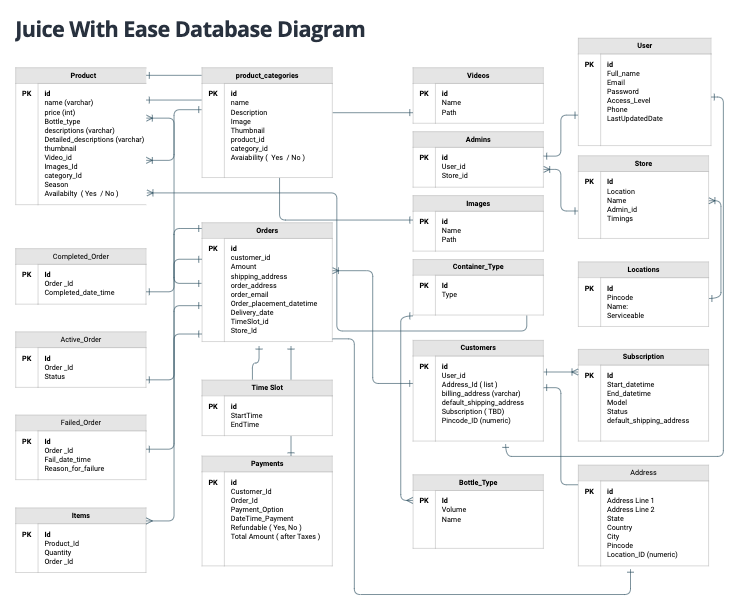
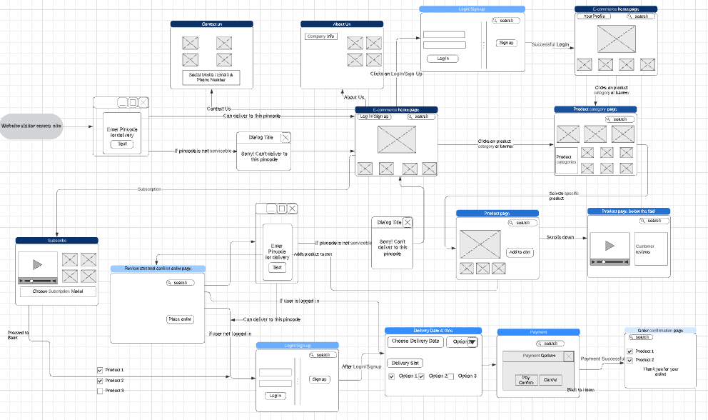

# Team_6_JuiceWithEase
CSE583 SDOS Winter 2021, IIITD

## Software Requirements Specification
## Overview    
This is a web-app for buying fresh cold pressed juices and beverages online and getting it delivered at your doorstep. The responsive web-app offers one-time delivery and a Daily/Weekly Basket: A customized subscription service where you can choose a variety of juices you want for as many weeks. The users would be able to explore product categories, see the product listing and add items to cart. They can choose the timings for their delivery, allowing 6hrs hours between the time at which order is placed and the expected delivery time. 
They can then proceed to checkout and pay using multiple payment options. The web-app will also have an Admin interface, which will allow the admin to track customer transactions and business statistics. 

## Entity Relationship Diagram      
  
[ERD Diagram](https://app.moqups.com/e8iFpgsYVG/view/page/a9222f231)

## User Journey    
  
[User Journey](https://lucid.app/lucidchart/8c403b1a-4229-4709-ba27-fa7b3375018c/view?page=bH3tPkT6qkiv#?folder_id=home&browser=icon)
